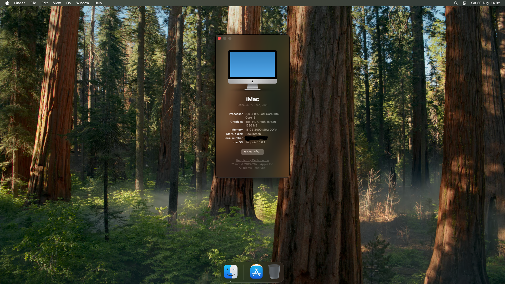

# OpenCore-7600K-H110-1660S

 
## What I use
1. OpenCore 1.0.5
1. MacOS Sequoia 15.6.1
1. SMBIOS: iMac20,1
1. CFG Lock: Disabled

### Hardware spec:
1. KabyLake i5 7600K
1. ASUS H110M-E/M.2 (but I don't use any of the M.2 slots)
1. 16GB DDR4 RAM
1. Samsung EVO 850 SATA SSD (120GB)
1. GTX1660 Super (not being used for mac. But can stay plugged in to motherboard)
1. iGPU: HD Graphics 630

### System config:
1. CFG Lock disabled.
1. Vt-x and Vt-d enabled.
1. Enable **Multi Monitor** on BIOS and set the **primary GPU** to **CPU Graphic**.
1. Plug HDMI directly to port on motherboard.

## To replicate
`MLB`, `ROM`, `SystemSerialNumber`, and `SystemUUID` are removed from this repo. Generate one for yourself.